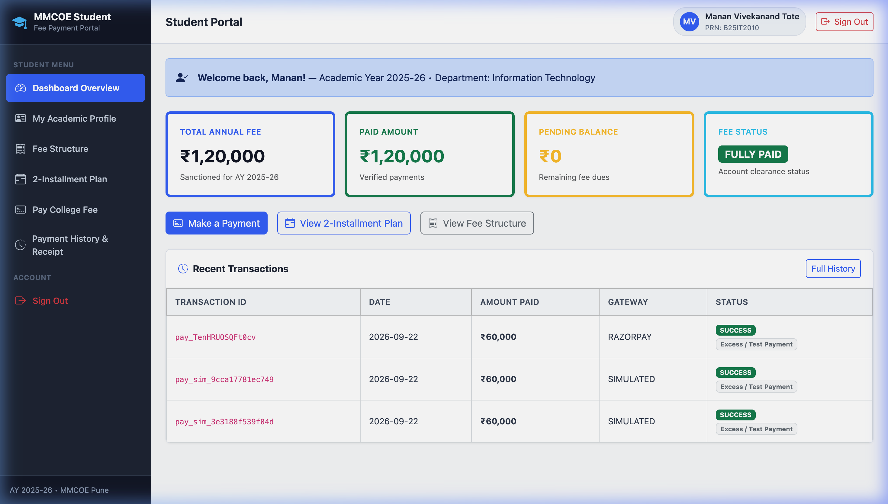
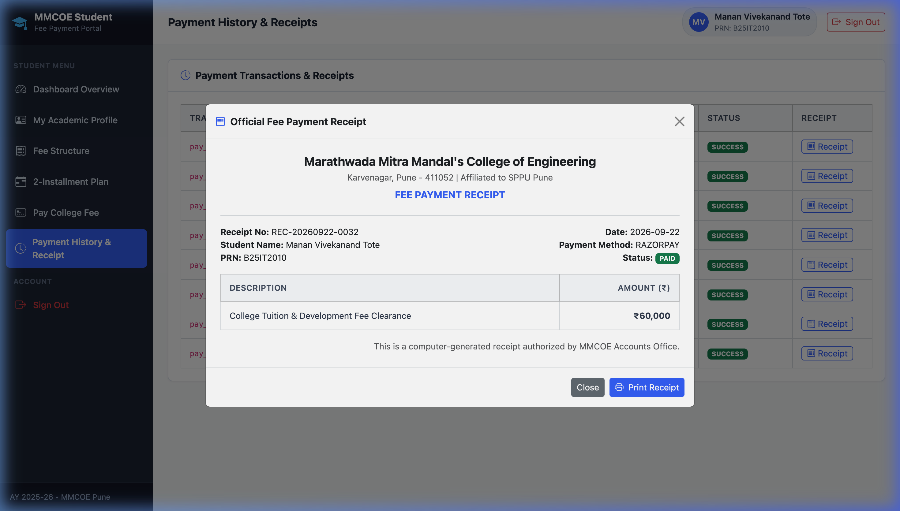
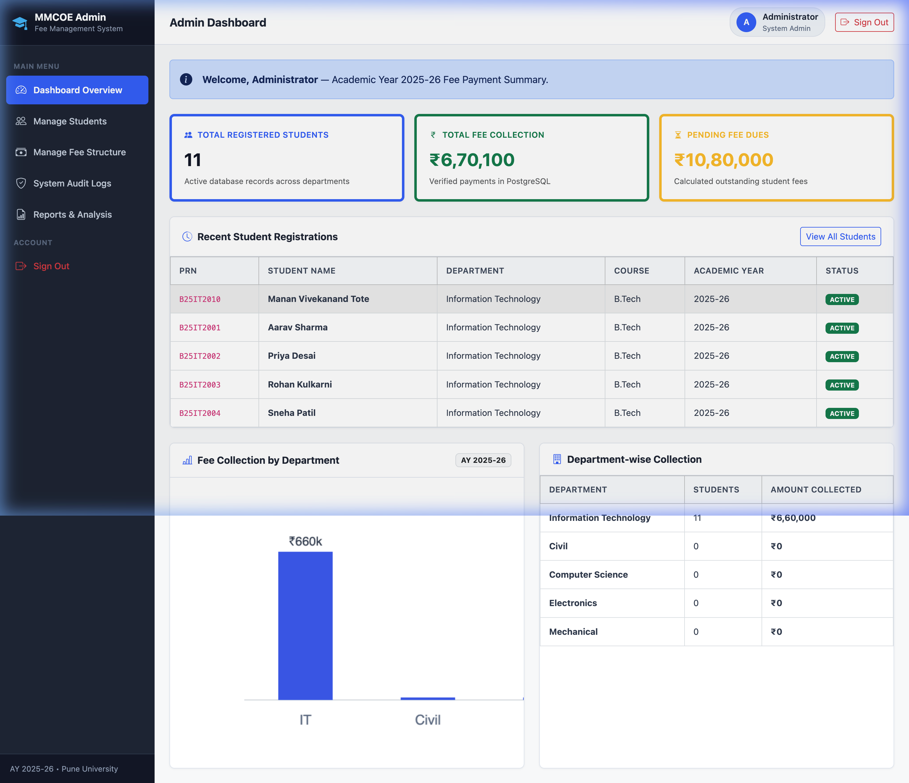
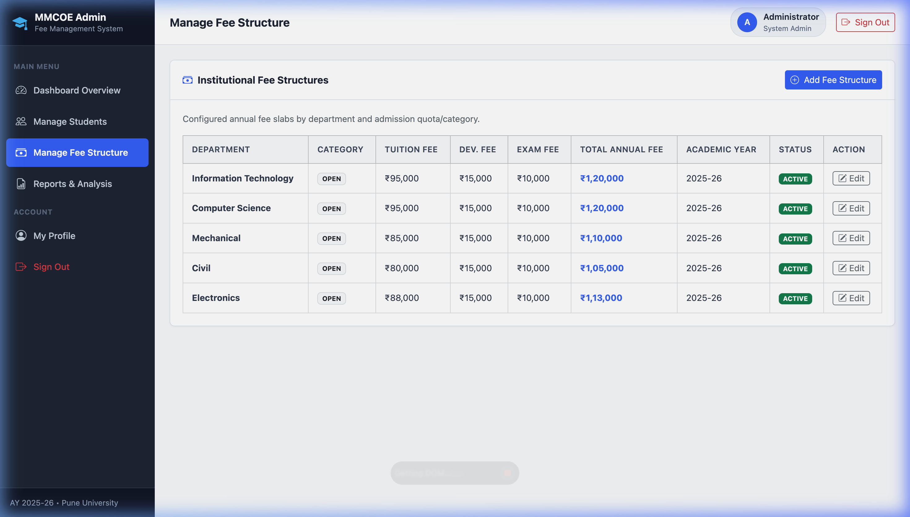
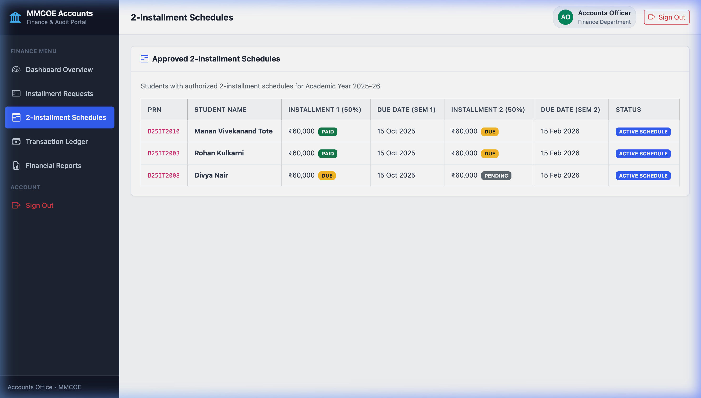
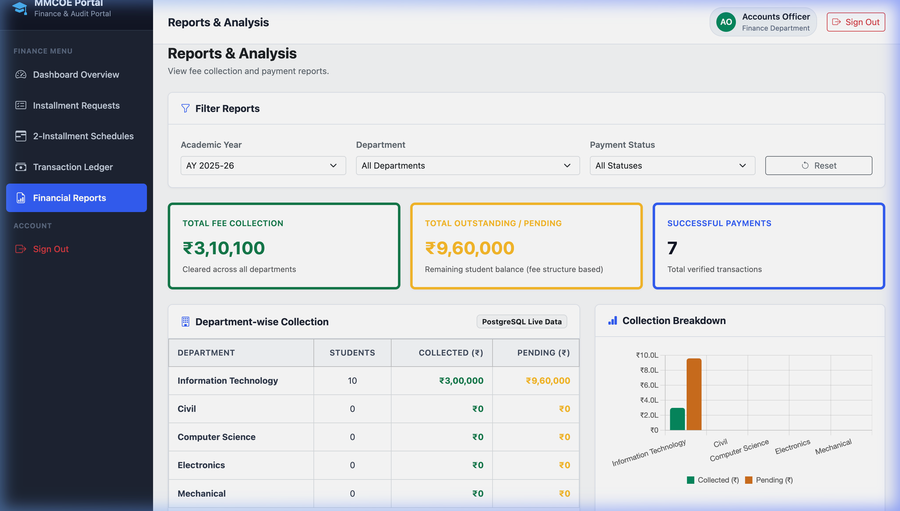
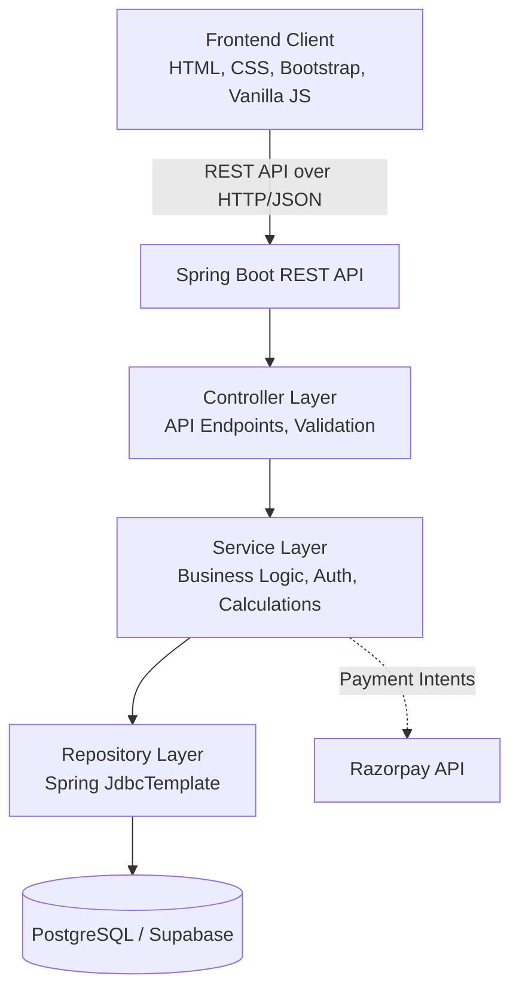

# Fee Payment Management System

A comprehensive, web-based fee payment management system designed for engineering colleges (BTech) to efficiently manage student fee structures, installment requests, online payments, receipts, and role-based administration.

**Tech Stack:** Java 21 • Spring Boot 3 • PostgreSQL • Vanilla JavaScript • Bootstrap 5 • Razorpay API

---

## 📌 Project Overview

Managing college fees manually or with fragmented systems often leads to discrepancies, delayed payments, and poor student experience. The **Fee Payment Management System** solves this by providing a unified digital platform where students can view their specific fee breakdown, request installment plans, and securely pay their dues online.

The system enforces structured business logic (such as calculating dynamic fees based on category, gender, quota, and family income) and maintains a robust transaction ledger. 

### Roles
The system operates on three primary user roles:
1. **Student:** Can view their applicable fee structure, request to pay in installments, execute online payments, and download receipts.
2. **Admin:** Responsible for core academic configurations. Can create dynamic fee structures, onboard new students, and analyze high-level reports.
3. **Accounts Officer:** Manages the financial workflows. Can review (approve/reject) student installment requests, monitor the real-time transaction ledger, and oversee payment settlements.

---

## ✨ Key Features

### 🎓 Student
* **Secure Login:** JWT-based authentication for secure session management.
* **Student Profile & Dashboard:** Live overview of applicable fees, paid amounts, and pending dues.
* **Detailed Fee Structure:** Transparent breakdown of fees (Tuition, Development, Exam, University, Library, Laboratory, Insurance, etc.).
* **Two-Installment Plan:** Ability to formally request to split the total academic fee into two equal installments.
* **Online Fee Payment:** Secure payment gateway integration (Razorpay) for processing transactions.
* **Payment History:** Chronological log of all successful and failed payment attempts.
* **Digital Receipts:** Instantly generated receipts for successful transactions.

### 🛡️ Admin
* **Executive Dashboard:** Live KPIs showing total students, total collected fees, and total pending dues across the college.
* **Student Management:** Interface to securely onboard and register new students.
* **Dynamic Fee Structure Management:** Create detailed fee structures customized by Department, BTech Year, Category (Open/Caste), Gender, Income Limit, and Quota.
* **Analytical Reports:** View overarching financial and demographic reports.

### 💰 Accounts Officer
* **Financial Dashboard:** Overview of recent transactions and pending financial requests.
* **Installment Request Review:** Dedicated workflow to evaluate, approve, or reject student requests for installment-based payments.
* **Transaction Ledger:** Live, comprehensive log of all college-wide transactions and Razorpay gateway logs.

---

## 📸 Screenshots

### Student View
*Dashboard showing fee breakdown, payment progress, and active installment schedules.*


*Detailed transaction history and receipt download.*


### Admin View
*Executive dashboard with financial KPIs.*


*Dynamic fee structure creation modal.*


### Accounts Officer View
*Dashboard displaying pending installment requests and ledger.*


*Analytical reports and aggregated data.*


---

## 🏗️ System Architecture

The application is built using a clean, layered architecture separating the frontend client from the robust Spring Boot backend. Database interactions are optimized using pure JDBC (`JdbcTemplate`) to avoid JPA overhead, maximizing query performance and control.



---

## 🚀 Getting Started

### Prerequisites
- **Java 21**
- **Maven**
- **PostgreSQL** (Local or Cloud like Supabase)
- **Razorpay Account** (Test API Keys)

### Setup & Run
1. **Configure Database:**
   Update `backend/src/main/resources/application.properties` with your PostgreSQL credentials.

2. **Configure Razorpay:**
   Add your test keys in `backend/src/main/resources/application.properties`.

3. **Run the Backend:**
   Navigate to the `backend` folder and run the Spring Boot application.
   ```bash
   cd backend
   mvn spring-boot:run
   ```

4. **Access the Application:**
   Open your browser and navigate to:
   ```
   http://localhost:8080
   ```